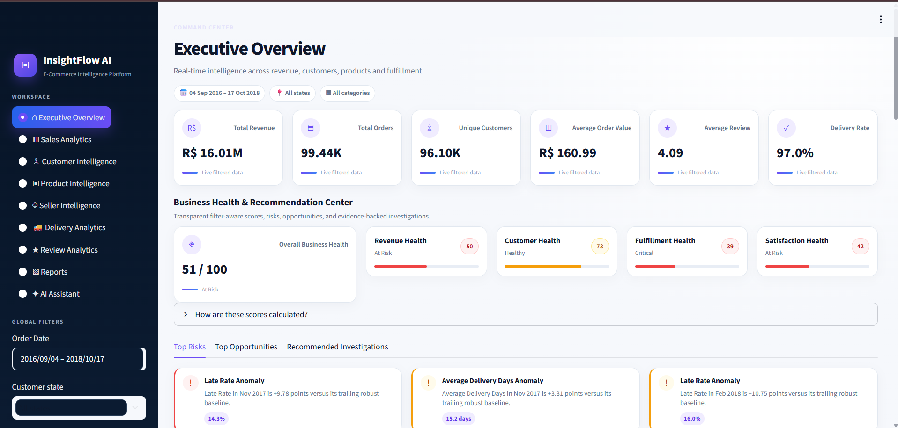
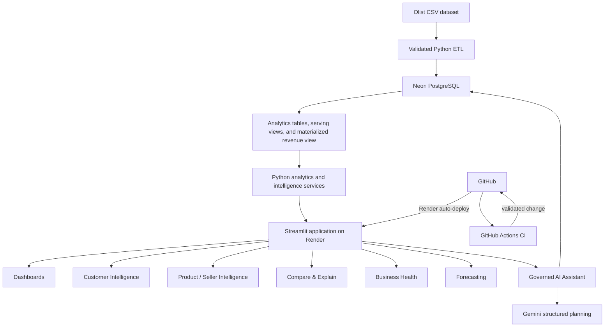
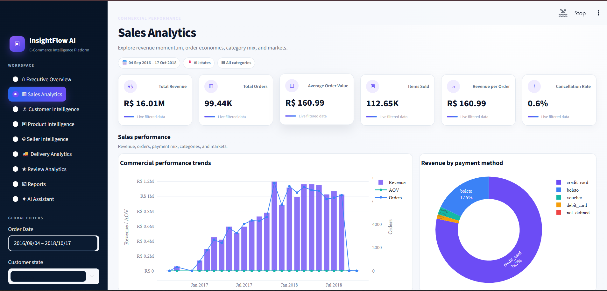
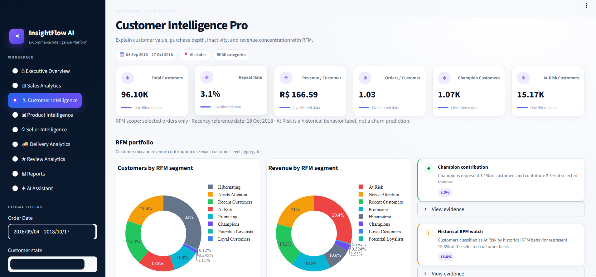
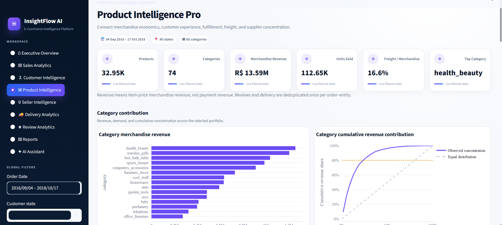
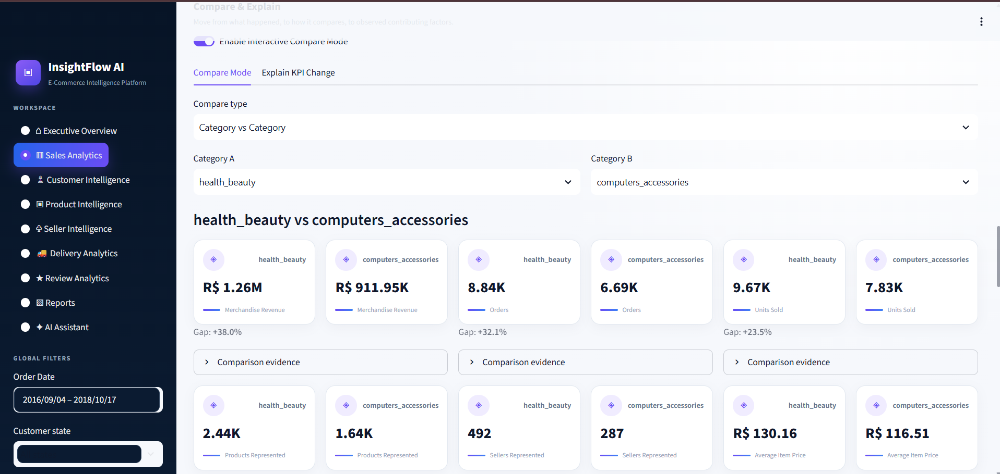
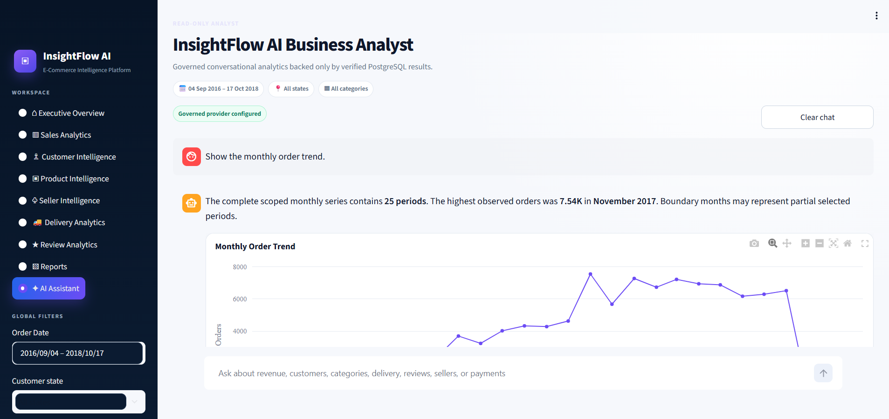
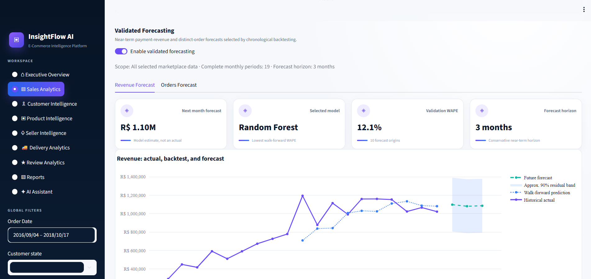

# InsightFlow AI

[](https://github.com/mahtopriyanshu/InsightFlow-AI/actions/workflows/ci.yml)

**A production-deployed e-commerce intelligence platform combining governed analytics, statistical forecasting, and a safe AI business analyst.**

## Live Demo

The application is live on Render and has been production-validated against Neon PostgreSQL and Gemini. The public URL is intentionally not listed because it is not stored in repository metadata; it can be provided directly for portfolio review.

## Project Overview

InsightFlow AI turns the anonymized Olist Brazilian marketplace dataset into an end-to-end decision-support product. A validated Python ETL pipeline loads a constrained PostgreSQL model; reusable analytics services power nine Streamlit workspaces; deterministic intelligence layers add comparisons, explanations, health scoring, anomaly detection, and forecasting; and a governed Gemini planner supports natural-language questions without allowing arbitrary SQL or Python execution.



## Business Problem

Marketplace decisions require consistent answers across orders, customers, products, sellers, payments, delivery events, and reviews. Raw files and ad hoc joins make metric definitions easy to distort. This project centralizes those records into a governed analytics layer so commercial, customer, fulfillment, and experience questions share the same filter scope, data grain, and evidence.

## Key Capabilities

- Executive overview with revenue, order, customer, satisfaction, and fulfillment health
- Sales, delivery, and review analytics with filter-aware trends and rankings
- Customer Intelligence with RFM segmentation, Pareto analysis, profiles, and search
- Product and Seller Intelligence covering economics, experience, freight, fulfillment, and concentration
- Deterministic anomaly and opportunity detection using completed-period robust baselines
- Compare Mode across periods, categories, destination states, and sellers
- Explain KPI with descriptive driver decomposition and explicit causal guardrails
- Business Health scores with component evidence, risks, opportunities, and recommendations
- Revenue and order forecasting with chronological validation and reliability guardrails
- Governed AI Business Analyst with verified answers, charts, tables, scope, SQL, and evidence
- Filter-aware CSV and Excel reports with a 50,000-row safety cap

## Production Architecture



GitHub Actions validates source changes; it does not host or deploy the application. Render independently auto-deploys the Git-backed Streamlit service. Neon provides managed PostgreSQL, and Gemini is used only for constrained Assistant planning.

## Analytics Capabilities

The analytics layer preserves business grain explicitly: payment revenue is aggregated once per order, merchandise and freight originate from order items, customers use `customer_unique_id`, and review/delivery metrics are deduplicated at the required order–entity grain. Global date, destination-state, and category filters propagate through dashboards, comparisons, intelligence services, forecasts, and Assistant queries.

Deterministic intelligence includes benchmark-relative insight cards, concentration/Pareto measures, robust rolling median and MAD/IQR anomaly detection, comparable-period analysis, entity comparisons, and descriptive KPI decomposition. Detailed design records are available in [`docs/10_analytics_serving_layer.md`](docs/10_analytics_serving_layer.md) through [`docs/17_business_health_recommendations.md`](docs/17_business_health_recommendations.md).

### Analytics Showcase

#### Sales Analytics



#### Customer Intelligence



#### Product Intelligence



#### Compare & Explain



## Governed AI Business Analyst


Gemini returns a structured plan constrained to approved intents, metrics, dimensions, and scopes. Application code—not the model—generates SQL. Validation permits one bounded read-only `SELECT` over approved schemas, tables, columns, functions, and join patterns. Execution uses a dedicated read-only connection, a 10-second statement timeout, and a 100-row limit. Unsupported, causal, unsafe, no-data, timeout, and provider-failure states remain distinct and user-friendly. See [`docs/19_governed_ai_business_analyst.md`](docs/19_governed_ai_business_analyst.md).

### AI Assistant in Action



## Forecasting and Intelligence

Payment revenue and distinct orders are forecast independently across five candidates:

- Naive
- Drift
- Linear Trend
- Holt Exponential Smoothing
- Random Forest

Model selection uses expanding-window one-step-ahead backtesting and WAPE, with MAE/RMSE retained as supporting evidence. Forecasts use a three-month horizon, exclude incomplete boundary periods, and refuse scopes with insufficient history or volume. Residual-based uncertainty bands communicate observed validation error without claiming guaranteed intervals. See [`docs/18_forecasting.md`](docs/18_forecasting.md).

### Validated Forecast



## Tech Stack

| Layer | Technologies |
|---|---|
| Application | Python 3.12, Streamlit, Plotly |
| Analytics | pandas, NumPy, SQL |
| Database | PostgreSQL, Neon, psycopg |
| Forecasting | scikit-learn, statsmodels |
| Governed AI | Gemini API, deterministic semantic layer, sqlglot |
| Export | CSV, openpyxl/Excel |
| Engineering | pytest, GitHub Actions, Render |

## Database Architecture

The `olist_analytics` schema contains nine curated source-aligned tables for categories, geography, customers, products, sellers, orders, items, payments, and reviews. Primary/foreign keys and analytical indexes are applied separately from ETL loading. A materialized one-row-per-order revenue object and stable revenue/delivery views prevent repeated fan-out errors while retaining a tested fallback query architecture.

Production runs on Neon PostgreSQL over SSL/TLS. The verified production dataset includes 99,441 orders, 99,441 customers, 32,951 products, 3,095 sellers, and 99,441 materialized order-revenue rows. See [`docs/06_database_design.md`](docs/06_database_design.md), [`docs/data_dictionary.md`](docs/data_dictionary.md), and [`docs/10_analytics_serving_layer.md`](docs/10_analytics_serving_layer.md).

## CI/CD

The [`CI workflow`](.github/workflows/ci.yml) runs on pushes to `main` and pull requests targeting `main`. It uses Python 3.12, caches pip downloads, compiles Python sources, runs repository secret/export safety checks, and executes 90 deterministic tests without Neon, Gemini, or Render credentials.

Render remains responsible for Git-backed auto-deployment after validated changes reach its deployment branch. The workflow contains no deployment key or production database access. See [`docs/22_ci_cd_quality_gates.md`](docs/22_ci_cd_quality_gates.md).

## Testing

- 106/106 validated unit tests at the frozen M19 baseline
- 38/38 focused Assistant tests and 15/15 golden business questions
- 14/14 Assistant UX checks
- All nine Streamlit pages rendered without Python/Streamlit exceptions
- Final M9–M19 regression: PASS
- Current credential-free CI suite: 90/90 PASS
- Production health, Render application, Neon database, and governed Render → Gemini → Neon path: PASS

Testing separates deterministic pull-request gates from database-backed milestone reconciliation, headless Streamlit validation, and bounded production smoke checks.

## Project Structure

```text
InsightFlow-AI/
├── .github/workflows/   # Credential-free CI quality gates
├── data/                # Ignored raw/processed data locations
├── database/            # PostgreSQL DDL, serving migration, validators
├── docs/                # Architecture and milestone design records
├── etl/                 # Extract, validate, transform, and load pipeline
├── notebooks/           # Dataset exploration and EDA
├── scripts/             # Repository safety automation
├── sql/                 # Reusable analytical SQL
├── streamlit_app/       # UI, services, intelligence, forecasting, Assistant
└── tests/               # Deterministic unit and security tests
```

## Local Setup

Requirements: Python 3.12+, PostgreSQL, and the Olist source CSV files under `data/raw/olist/`.

```bash
python -m venv .venv
# Windows: .\.venv\Scripts\Activate.ps1
# macOS/Linux: source .venv/bin/activate
python -m pip install -r requirements.txt
```

Copy `.env.example` to `.env`, configure the variables below, then initialize PostgreSQL from the repository root:

```bash
createdb insightflow_ai
psql -d insightflow_ai -f database/schema.sql
python -m etl.run_pipeline
psql -d insightflow_ai -f database/constraints.sql
psql -d insightflow_ai -f database/indexes.sql
python database/apply_milestone10.py
python -m streamlit run streamlit_app/app.py
```

## Environment Variables

| Name | Purpose |
|---|---|
| `DB_HOST` | PostgreSQL host |
| `DB_PORT` | PostgreSQL port |
| `DB_NAME` | PostgreSQL database |
| `DB_USER` | PostgreSQL user |
| `DB_PASSWORD` | PostgreSQL password |
| `AI_API_KEY` | Gemini/provider API key |
| `AI_PROVIDER` | Governed planner provider (`gemini` by default) |
| `AI_MODEL` | Provider model name |
| `AI_BASE_URL` | Provider API base URL |

Values belong in local `.env` or protected Render environment configuration—never in Git.

## Security Practices

- Environment-driven secrets with `.env` and `.streamlit/secrets.toml` ignored
- CI gate blocking tracked environment files, credential notes, and database dumps
- Parameterized SQL and explicit semantic/schema/table/column/function allowlists
- Dedicated bounded read-only Assistant database execution
- Generic user-facing operational errors and logs that omit secrets and connection strings
- Manual provider retry with no automatic Gemini retry loop

## Known Limitations

- Olist is a historical anonymized dataset and does not represent current marketplace conditions
- Observational comparisons and driver decomposition do not establish causality
- Forecasts use limited monthly history; residual bands are decision-support evidence, not guarantees
- Gemini availability and quota affect Assistant planning, while non-AI analytics remain available
- Streamlit caches are process-local rather than distributed
- Some deployed sidebar controls have a lighter cosmetic background than local rendering
- Current Streamlit versions warn that `use_container_width` is deprecated; behavior remains functional

## Future Improvements

- Add branch protection requiring the CI check before merge
- Pin and periodically review runtime dependency versions through focused upgrade work
- Add a small scheduled production health check if operational ownership requires it
- Evaluate accessibility contrast and migrate deprecated Streamlit width arguments in a dedicated UI-maintenance change

## Documentation

- [Current architecture](docs/architecture.md)
- [Production readiness](docs/20_production_readiness.md)
- [Cloud deployment validation](docs/21_cloud_deployment_production_validation.md)
- [CI/CD quality gates](docs/22_ci_cd_quality_gates.md)
- [Portfolio screenshot plan](docs/portfolio_screenshot_plan.md)
- [Final portfolio and release story](docs/23_portfolio_final_release.md)
