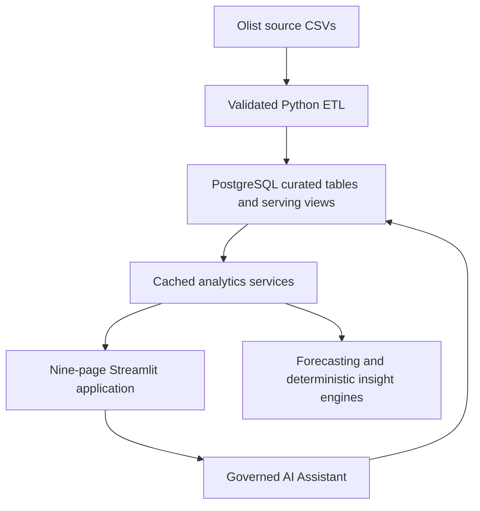

# InsightFlow AI

InsightFlow AI is an end-to-end e-commerce intelligence platform built on the Olist marketplace dataset. It combines governed PostgreSQL analytics, interactive Streamlit decision-support workflows, statistical forecasting, and a constrained AI business analyst.

## Problem

Marketplace data is spread across orders, customers, products, sellers, payments, delivery events, and reviews. InsightFlow AI turns those disconnected records into consistent business metrics, searchable entity intelligence, evidence-backed insights, and safe natural-language analysis without allowing an AI provider to execute arbitrary code or SQL.

## Major Features

- Executive and business analytics for revenue, orders, customers, payments, delivery, and reviews
- Customer intelligence with RFM segmentation, Pareto analysis, profiles, and scoped search
- Product and Seller Intelligence covering economics, experience, fulfillment, freight, and concentration
- Deterministic anomaly and opportunity detection using completed-period historical baselines
- Compare Mode for periods, categories, destination states, and sellers
- Explain KPI with descriptive, evidence-backed driver decomposition and causal guardrails
- Business Health scoring with transparent components, risks, opportunities, and recommendations
- Revenue and order forecasting with chronological validation and reliability guardrails
- Governed AI Business Analyst with filter-aware questions, verified answers, charts, tables, and query evidence
- Filter-aware reports with CSV and Excel exports and a 50,000-row cap

## AI Assistant Architecture


Gemini produces only a structured plan constrained to approved intents, metrics, dimensions, and scopes. Application code generates the SQL, validates it structurally, and executes it through a dedicated read-only connection with a statement timeout and row limit. Gemini never directly executes arbitrary SQL or Python.

## Forecasting

The forecasting workspace evaluates five candidates:

- Naive
- Drift
- Linear Trend
- Holt Exponential Smoothing
- Random Forest

Models are compared using expanding-window, one-step-ahead backtesting. The lowest-WAPE eligible model is selected independently for payment revenue and distinct orders, then used for a three-month horizon. Forecasts are decision-support estimates rather than guarantees; filtered scopes with insufficient history or volume are rejected by explicit guardrails.

## Tech Stack

- Python, pandas, NumPy
- Streamlit and Plotly
- PostgreSQL and psycopg
- SQL and sqlglot
- scikit-learn and statsmodels
- Jupyter notebooks for exploration
- pytest for automated validation
- Gemini API for constrained Assistant planning

## Security

- Database and provider secrets are loaded from environment variables; `.env` and `.streamlit/secrets.toml` are ignored
- Assistant SQL is generated by deterministic application code from semantic allowlists
- sqlglot enforces one bounded read-only `SELECT`, approved schemas/tables/columns/functions, and join limits
- Assistant execution uses a dedicated read-only PostgreSQL transaction mode, a 10-second timeout, and a 100-row limit
- User-facing failures and operational logs do not include raw credentials or connection strings

## Testing

The validated M19 baseline includes:

- 106/106 unit tests passed
- 38/38 focused Assistant tests passed
- 15/15 golden Assistant questions passed
- 14/14 Assistant UX checks passed
- All nine Streamlit pages rendered without Python or Streamlit exceptions
- Final M9–M19 regression: PASS

M20 reused focused tests for Product Intelligence, anomalies, forecasting resilience, provider failure, and startup health. It did not rerun the frozen full regression suite.

## Local Setup

Requirements: Python 3.12+, PostgreSQL, and the Olist source CSV files under `data/raw/olist/`.

1. Create and activate a virtual environment from the repository root:

   ```bash
   python -m venv .venv
   ```

   Windows PowerShell:

   ```powershell
   .\.venv\Scripts\Activate.ps1
   ```

   macOS/Linux:

   ```bash
   source .venv/bin/activate
   ```

2. Install dependencies:

   ```bash
   python -m pip install -r requirements.txt
   ```

3. Copy `.env.example` to `.env` and provide local values for `DB_HOST`, `DB_PORT`, `DB_NAME`, `DB_USER`, and `DB_PASSWORD`. Add `AI_API_KEY` to enable Gemini planning. Never commit `.env`.

4. Create the PostgreSQL database and initialize it in repository order:

   ```bash
   createdb insightflow_ai
   psql -d insightflow_ai -f database/schema.sql
   python -m etl.run_pipeline
   psql -d insightflow_ai -f database/constraints.sql
   psql -d insightflow_ai -f database/indexes.sql
   python database/apply_milestone10.py
   ```

5. Start the application:

   ```bash
   python -m streamlit run streamlit_app/app.py
   ```

## Architecture



The application uses five-minute Streamlit data caches and a reusable read-only PostgreSQL application connection. The Assistant uses a separate bounded read-only connection for each governed execution.

## Limitations

- The Olist dataset is historical and anonymized; results do not represent current marketplace conditions
- Observational comparisons and driver decompositions do not establish causality
- Forecasts use limited historical monthly data and a three-month horizon; uncertainty bands are empirical, not guarantees
- Gemini availability and quota affect planning, although existing analytics remain available
- Streamlit caching is process-local and is not a distributed production cache
- The application assumes the validated PostgreSQL schema and serving objects already exist

## Deployment

M20 prepares configuration, resilience, logging, and performance for deployment, but the project is not deployed yet. Cloud deployment and provider-specific infrastructure are the scope of the next milestone, M21.
