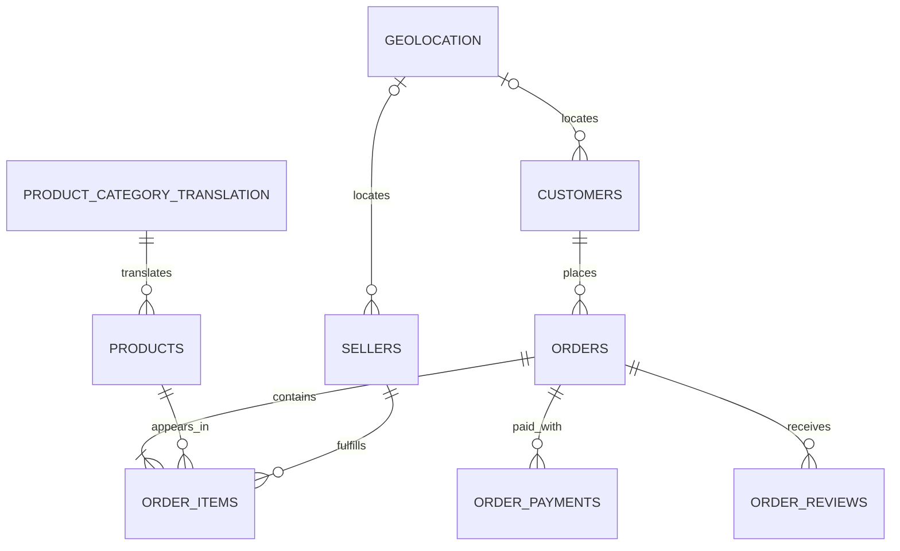

# Milestone 2: Dataset Selection

## Final selection

**Selected dataset: Olist Brazilian E-commerce Public Dataset**

Olist is the best fit for InsightFlow AI because it provides the strongest balance of real-world business realism, relational SQL, dashboards, business analysis, and credible entry-level machine learning. It contains anonymized commercial data for roughly 100,000 marketplace orders from 2016–2018, rather than a purely fictional teaching scenario. Its separate order, item, customer, seller, product, payment, review, and geolocation files are complex enough to demonstrate end-to-end analytics while remaining understandable to a fresher.

This milestone makes a selection only. The dataset has **not** been downloaded, cleaned, explored, or transformed.

## Dataset comparison

Ratings use a five-point scale: 1 = limited, 3 = moderate, and 5 = excellent for this project's goals. Table counts describe commonly used versions and may vary by distribution.

| Criterion | Olist | AdventureWorks | Northwind | Superstore |
|---|---:|---:|---:|---:|
| Real-world business realism | **5** — anonymized marketplace transactions | 4 — detailed but fictional manufacturer/retailer | 3 — relatable but fictional and dated wholesaler | 3 — clean, fictional retail sample |
| Number of related tables | **4** — 9 core CSV tables | **5** — dozens of OLTP tables across several schemas | 4 — commonly 13–14 tables | 2 — usually a small workbook centered on order rows |
| SQL practice opportunities | **5** — joins, CTEs, windows, cohorts, intervals | **5** — deepest schema and advanced SQL breadth | 4 — strong foundational joins and aggregation | 3 — useful basics, less relational depth |
| Dashboard opportunities | **5** — sales, sellers, logistics, payments, reviews, geography | 5 — sales, inventory, purchasing, production, HR | 4 — sales, products, suppliers, employees, shipping | **5** — visualization-friendly sales and profit fields |
| Business analysis opportunities | **5** — growth, service quality, seller performance | 5 — broad enterprise processes | 4 — clear but narrower small-business cases | 4 — strong retail KPIs, fewer operational processes |
| Machine learning opportunities | **5** — delay, review, freight, value and segmentation | 4 — forecasting and operations, but labels need framing | 2 — small and less suitable for robust modeling | 3 — forecasting and segmentation, limited behavioral signals |
| Suitability for a fresher portfolio | **5** — distinctive, realistic, broad, manageable | 4 — impressive but complex and Microsoft-tooling-heavy | 3 — accessible but less differentiated | 3 — accessible but heavily used and dashboard-oriented |
| **Overall** | **34/35** | 32/35 | 24/35 | 23/35 |

## Why Olist was selected

- Real marketplace data includes natural operational complexity: multiple items and sellers, installments, freight, delivery timestamps, and reviews.
- Nine core files offer substantial relational depth without the overhead of a large enterprise schema.
- The same dataset supports analyst, business analyst, and junior data scientist portfolio stories.
- Analysis can connect revenue, customers, product mix, seller quality, logistics, payments, geography, and satisfaction.
- Predictive targets such as late delivery and low review score have clear business actions.

## Why the alternatives were not selected

### AdventureWorks

AdventureWorks is the closest alternative and is stronger for enterprise-schema breadth. Microsoft provides OLTP, data warehouse, and lightweight variants. However, it is fictional, considerably more complex, and commonly distributed as a SQL Server backup. That raises setup and domain-model overhead for a fresher. It is excellent for database-specialist practice, but Olist provides a clearer path from raw source files to marketplace decisions and predictive analytics.

### Northwind

Northwind is excellent for foundational relational SQL. Its customers, orders, order details, products, suppliers, employees, and shippers form an approachable model. It was not selected because it is a small, fictional, decades-old tutorial scenario with limited volume and weak modern ML potential. It would demonstrate SQL basics well but make the broader platform less distinctive.

### Superstore

Superstore is convenient for learning Tableau and producing polished sales/profit dashboards. Tableau describes it as a small, clean sample containing fictitious retail data. It was not selected because it is usually centered on a flat order-line table, leaving less scope for relational modeling, marketplace operations, reviews, payment behavior, and meaningful supervised learning.

## Evidence sources

- [Olist Brazilian E-commerce Public Dataset](https://www.kaggle.com/datasets/olistbr/brazilian-ecommerce)
- [Microsoft AdventureWorks sample databases](https://learn.microsoft.com/en-us/sql/samples/adventureworks-install-configure)
- [Microsoft SQL Server Northwind sample](https://github.com/microsoft/sql-server-samples/tree/master/samples/databases/northwind-pubs)
- [Tableau: What makes Superstore useful](https://help.tableau.com/current/pro/desktop/en-us/find_good_datasets.htm)

## Business scenario

InsightFlow AI will serve a Brazilian e-commerce marketplace. Leadership needs a unified view of commercial performance and customer experience across orders, products, sellers, payments, delivery, and reviews. Analysts must identify growth opportunities and bottlenecks; business stakeholders need decision-ready KPIs; and data scientists need well-defined prediction problems that can improve service quality.

The future platform should reveal where growth originates, which sellers and products create value or risk, how logistics and payment behavior affect satisfaction, and which active orders are at risk of arriving late or receiving poor reviews.

## Expected data model

### Expected tables

| Table | Grain and purpose |
|---|---|
| `customers` | One row per order-level customer ID, with stable customer identifier and location |
| `orders` | One row per order, with status and purchase-to-delivery timestamps |
| `order_items` | One row per item sequence within an order, with product, seller, price, freight, and deadline |
| `order_payments` | One row per payment sequence, with type, installments, and value |
| `order_reviews` | One row per review record, with score, text, and timestamps |
| `products` | One row per product, with category and physical attributes |
| `sellers` | One row per seller, with location |
| `geolocation` | Multiple coordinate observations per ZIP-code prefix |
| `product_category_translation` | One row per Portuguese category and English translation |

### Expected relationships

- A customer record associates with an order through `customer_id`; `customer_unique_id` groups repeat purchases across order-level IDs.
- One order has many order items and can have multiple payment records.
- An order links to a review; validation will determine whether exceptions require one-to-many handling.
- One product and one seller can each appear in many order items; one order can contain multiple sellers.
- One translated product category describes many products.
- Customer and seller ZIP prefixes map to summarized geolocation records. Raw geolocation must not be joined as if the prefix were unique.

### Primary keys and foreign keys

The source is CSV rather than a database with enforced constraints. These expected logical keys must be validated after download.

| Table | Expected primary key | Expected foreign keys / references |
|---|---|---|
| `customers` | `customer_id` | ZIP prefix → derived geography dimension |
| `orders` | `order_id` | `customer_id` → `customers.customer_id` |
| `order_items` | (`order_id`, `order_item_id`) | `order_id` → `orders`; `product_id` → `products`; `seller_id` → `sellers` |
| `order_payments` | (`order_id`, `payment_sequential`) | `order_id` → `orders.order_id` |
| `order_reviews` | `review_id` (subject to uniqueness validation) | `order_id` → `orders.order_id` |
| `products` | `product_id` | `product_category_name` → `product_category_translation` |
| `sellers` | `seller_id` | ZIP prefix → derived geography dimension |
| `geolocation` | No reliable raw key; derive a surrogate or aggregate by ZIP prefix | None |
| `product_category_translation` | `product_category_name` | None |

### Simple ER diagram

The geolocation links are conceptual. A later modeling milestone should create an aggregated ZIP-prefix dimension before enforcing them.

## Candidate business questions

These questions define future analytical scope only; they are not answered here.

### Sales

1. How do order count, gross merchandise value, and average order value change by month?
2. Which states and cities contribute the most revenue and growth?
3. How much revenue is associated with delivered, canceled, unavailable, or open orders?

### Customers

4. What proportion of unique customers make repeat purchases, and how quickly do they return?
5. Which customer cohorts retain or spend more over time?
6. How do value, frequency, and product preferences vary by geography?

### Products

7. Which categories lead in units, revenue, freight burden, and satisfaction?
8. Which categories are growing or declining over time?
9. Do product weight and dimensions materially affect freight cost or delivery time?

### Sellers

10. Which sellers generate the most sales, orders, and geographic reach?
11. Which sellers have the highest late-delivery, cancellation, or low-review rates?
12. How concentrated is marketplace revenue among the top sellers?

### Delivery

13. What is the on-time rate by month, route, state, seller, and category?
14. Where do the largest delays occur between purchase, approval, carrier handoff, and delivery?
15. Where are delivery estimates consistently too optimistic or conservative?

### Payments

16. Which payment methods are most common, and how do their order values differ?
17. How does installment count relate to basket value, category, or geography?
18. Do payment method and installment behavior vary by segment or over time?

### Reviews

19. How are review scores distributed by category, seller, geography, and month?
20. How strongly do delivery delay and freight value relate to review score?
21. What themes and sentiment appear in low- and high-rated comments?

### Predictive analytics

22. Can order, seller, product, route, and timing features predict late delivery?
23. Can pre-review operational features predict the risk of a low review score?
24. Can purchasing history support customer segmentation or repeat-purchase propensity modeling?
25. Can category, geography, and seasonality forecast order volume or revenue?

## Exact next step

After this milestone is reviewed and approved, define a reproducible acquisition plan: confirm the official Olist source and license, record the expected file manifest and checksums, and specify where untouched files will be stored under `data/raw/`—without cleaning or transforming them during acquisition.
