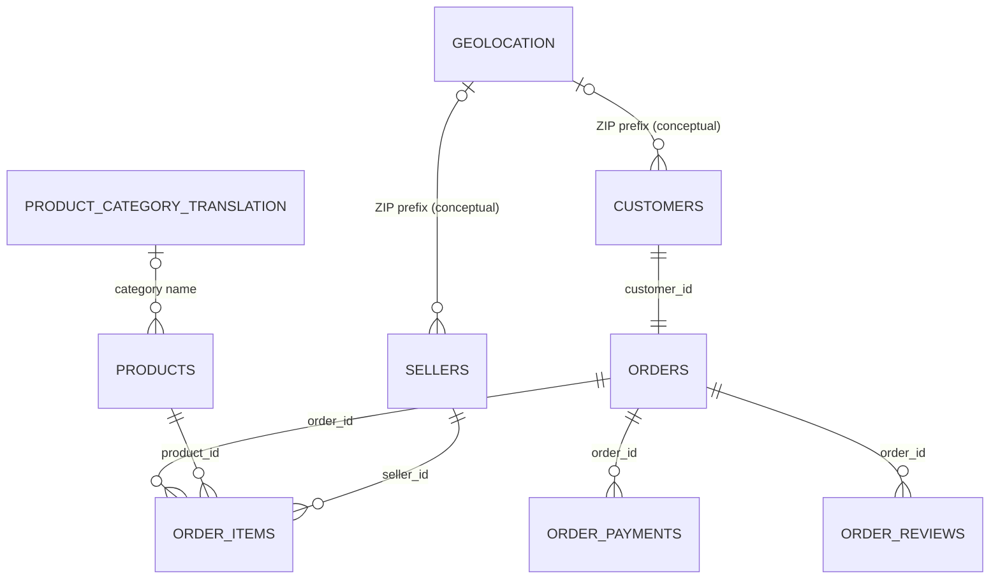

# Milestone 2B: Olist Dataset Inventory

## Scope and inspection method

This inventory covers the nine CSV files stored unchanged in `data/raw/olist/`. Inspection was limited to headers, record counts, candidate-key uniqueness, blank key parts, and foreign-key coverage. No values were cleaned, transformed, imputed, summarized for business insight, or used for exploratory data analysis.

The files contain **1,583,922 rows**, **52 columns across nine tables**, and occupy **126,186,995 bytes (126.19 MB / 120.34 MiB)** in total. Row counts exclude the header row.

## File inventory

| CSV file | Rows | Columns | Size (bytes) | Simple business meaning |
|---|---:|---:|---:|---|
| `olist_customers_dataset.csv` | 99,441 | 5 | 9,033,957 | Identifies the customer attached to each order and provides a stable customer identifier plus city, state, and ZIP prefix. |
| `olist_geolocation_dataset.csv` | 1,000,163 | 5 | 61,273,883 | Provides geographic coordinates and place names observed for Brazilian ZIP-code prefixes. A prefix can have many coordinate rows. |
| `olist_order_items_dataset.csv` | 112,650 | 7 | 15,438,671 | Lists the individual products inside orders, the seller responsible, item price, freight charge, and shipping deadline. |
| `olist_order_payments_dataset.csv` | 103,886 | 5 | 5,777,138 | Records how each order was paid, including split/sequential payments, payment method, installments, and value. |
| `olist_order_reviews_dataset.csv` | 99,224 | 7 | 14,451,670 | Stores customer ratings and optional written feedback submitted for orders, together with review dates. |
| `olist_orders_dataset.csv` | 99,441 | 8 | 17,654,914 | Represents the order lifecycle from purchase through approval, carrier handoff, delivery, and estimated delivery. |
| `olist_products_dataset.csv` | 32,951 | 9 | 2,379,446 | Describes products by category, text/photo metadata, weight, and physical dimensions. |
| `olist_sellers_dataset.csv` | 3,095 | 4 | 174,703 | Identifies marketplace sellers and their city, state, and ZIP prefix. |
| `product_category_name_translation.csv` | 71 | 2 | 2,613 | Translates Portuguese product-category names into English. |

## Columns by table

### `olist_customers_dataset.csv`

- `customer_id` — order-level customer key used by the orders table.
- `customer_unique_id` — stable identifier used to recognize the same buyer across different orders.
- `customer_zip_code_prefix` — first digits of the customer's postal code.
- `customer_city` — customer city.
- `customer_state` — two-letter customer state code.

### `olist_geolocation_dataset.csv`

- `geolocation_zip_code_prefix` — postal-code prefix associated with the location observation.
- `geolocation_lat` — latitude.
- `geolocation_lng` — longitude.
- `geolocation_city` — city recorded for the observation.
- `geolocation_state` — two-letter state code recorded for the observation.

### `olist_order_items_dataset.csv`

- `order_id` — order containing the item.
- `order_item_id` — sequential item number within the order.
- `product_id` — product purchased.
- `seller_id` — seller fulfilling the item.
- `shipping_limit_date` — seller's shipping deadline.
- `price` — item selling price.
- `freight_value` — freight charged for the item.

### `olist_order_payments_dataset.csv`

- `order_id` — order being paid for.
- `payment_sequential` — sequence number when an order has more than one payment record.
- `payment_type` — payment method.
- `payment_installments` — number of installments.
- `payment_value` — value of the payment record.

### `olist_order_reviews_dataset.csv`

- `review_id` — identifier assigned to a review event.
- `order_id` — reviewed order.
- `review_score` — customer rating.
- `review_comment_title` — optional review title.
- `review_comment_message` — optional written review.
- `review_creation_date` — date the review was created.
- `review_answer_timestamp` — timestamp when the review was submitted/answered.

### `olist_orders_dataset.csv`

- `order_id` — unique order identifier.
- `customer_id` — order-level customer identifier.
- `order_status` — current/final order status.
- `order_purchase_timestamp` — purchase timestamp.
- `order_approved_at` — payment/order approval timestamp.
- `order_delivered_carrier_date` — carrier handoff timestamp.
- `order_delivered_customer_date` — customer delivery timestamp.
- `order_estimated_delivery_date` — promised/estimated delivery date.

### `olist_products_dataset.csv`

- `product_id` — unique product identifier.
- `product_category_name` — Portuguese category name.
- `product_name_lenght` — source-provided product-name character count; the original header spelling is retained.
- `product_description_lenght` — source-provided description character count; the original header spelling is retained.
- `product_photos_qty` — number of product photos.
- `product_weight_g` — product weight in grams.
- `product_length_cm` — product length in centimetres.
- `product_height_cm` — product height in centimetres.
- `product_width_cm` — product width in centimetres.

### `olist_sellers_dataset.csv`

- `seller_id` — unique seller identifier.
- `seller_zip_code_prefix` — seller postal-code prefix.
- `seller_city` — seller city.
- `seller_state` — two-letter seller state code.

### `product_category_name_translation.csv`

- `product_category_name` — Portuguese category name used in the products table.
- `product_category_name_english` — English category name.

## Verified primary keys

The CSV format does not enforce database constraints. “Primary key” below means a candidate key verified as nonblank and unique across the raw file.

| Table | Verified primary key | Verification result |
|---|---|---|
| Customers | `customer_id` | 99,441 distinct values in 99,441 rows; no blanks |
| Geolocation | None in the raw file | ZIP prefix is not unique: 19,015 distinct prefixes in 1,000,163 rows |
| Order items | (`order_id`, `order_item_id`) | 112,650 distinct pairs in 112,650 rows; no blanks |
| Order payments | (`order_id`, `payment_sequential`) | 103,886 distinct pairs in 103,886 rows; no blanks |
| Order reviews | (`review_id`, `order_id`) | 99,224 distinct pairs in 99,224 rows; no blanks |
| Orders | `order_id` | 99,441 distinct values in 99,441 rows; no blanks |
| Products | `product_id` | 32,951 distinct values in 32,951 rows; no blanks |
| Sellers | `seller_id` | 3,095 distinct values in 3,095 rows; no blanks |
| Category translation | `product_category_name` | 71 distinct values in 71 rows; no blanks |

Important key interpretation:

- `customer_unique_id` is a business/entity identifier, not the row primary key: 96,096 distinct values occur in 99,441 customer rows. This is intentional and enables repeat-customer linkage.
- `customer_id` is also unique in `orders`, so the source implements a one-to-one link between an order and its order-level customer record.
- Neither `review_id` nor `order_id` alone is unique in the reviews file. The verified raw-row key is the composite (`review_id`, `order_id`).
- Geolocation requires a future modeling choice such as a surrogate row key or a derived ZIP-prefix dimension. No such transformation was performed here.

## Verified foreign keys and relationships

### Core transactional relationships

| Child foreign key | Parent key | Cardinality | Verification |
|---|---|---|---|
| `orders.customer_id` | `customers.customer_id` | Customer row 1 ↔ 1 order | Valid: 0 orphan rows |
| `order_items.order_id` | `orders.order_id` | Order 1 → 0..many items | Valid: 0 orphan rows |
| `order_items.product_id` | `products.product_id` | Product 1 → 0..many items | Valid: 0 orphan rows |
| `order_items.seller_id` | `sellers.seller_id` | Seller 1 → 0..many items | Valid: 0 orphan rows |
| `order_payments.order_id` | `orders.order_id` | Order 1 → 0..many payments | Valid: 0 orphan rows |
| `order_reviews.order_id` | `orders.order_id` | Order 1 → 0..many review rows | Valid: 0 orphan rows |

All six core foreign-key relationships have complete parent coverage in the raw data.

### Lookup/geographic relationships

| Child reference | Parent lookup | Verification |
|---|---|---|
| `products.product_category_name` | `product_category_name_translation.product_category_name` | Incomplete: excluding blank categories, 13 product rows across 2 category values have no translation |
| `customers.customer_zip_code_prefix` | `geolocation.geolocation_zip_code_prefix` | Incomplete: 278 customer rows across 157 prefixes have no geolocation match |
| `sellers.seller_zip_code_prefix` | `geolocation.geolocation_zip_code_prefix` | Incomplete: 7 seller rows across 7 prefixes have no geolocation match |

The category values without translations are `portateis_cozinha_e_preparadores_de_alimentos` (10 product rows) and `pc_gamer` (3 product rows). These are documented exactly as found and were not corrected.

ZIP-prefix references are conceptual lookup relationships, not enforceable foreign keys against the raw geolocation file, because `geolocation_zip_code_prefix` is highly non-unique. A later data-modeling milestone should first define a deterministic ZIP-prefix geography dimension.

## Relationship diagram

## Inspection-only data quality observations

These are structural observations encountered while verifying keys and relationships, not EDA results:

- `customer_unique_id` repeats by design and should be used to connect repeat purchases; it must not replace `customer_id` as the customer-file row key.
- `review_id` has 98,410 distinct values across 99,224 rows, while `order_id` has 98,673 distinct values. The composite pair is unique, so reviews must not be modeled with either field alone as the raw primary key.
- Product category is blank in 610 product rows.
- Two nonblank product categories (13 rows total) are absent from the translation lookup.
- Some customer and seller ZIP prefixes have no raw geolocation match.
- A ZIP prefix occurs many times in geolocation, so joining it directly can multiply rows.
- Original column names `product_name_lenght` and `product_description_lenght` contain the source spelling `lenght`; raw headers remain unchanged.
- Items appear for 98,666 of 99,441 orders, payments for 99,440 orders, and reviews for 98,673 orders. These optional/missing child records are consistent with zero-to-many relationships and should be handled deliberately later.

## Complete data model summary

`orders` is the central business event. It links one-to-one to the order-level record in `customers`, while `customer_unique_id` groups those records into real repeat buyers. Each order can connect to multiple item, payment, and review rows. Each item resolves to exactly one product and one seller; therefore, order items bridge orders to both products and sellers and allow a single order to involve several products or sellers. Products optionally map from Portuguese category names to English labels. Customer and seller ZIP prefixes can be enriched from geolocation only after the many-row geolocation source is reduced to a controlled ZIP-prefix model. The core transaction graph has full referential coverage; category translation and geographic enrichment are incomplete optional lookups in the raw source.
