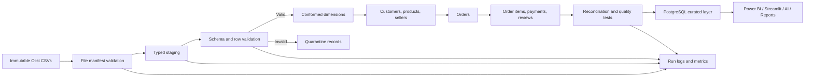

# Milestone 4A: ETL Design

## 1. ETL Overview

The InsightFlow AI ETL pipeline will convert nine immutable Olist CSV files into typed, validated, relational datasets ready for PostgreSQL. The design separates ingestion from business transformation so a failed rule never changes or hides the source evidence.

The pipeline will be:

- **Idempotent:** rerunning the same source version produces the same curated result.
- **Auditable:** every run records source identity, row counts, rules, warnings, rejects, and outputs.
- **Fail-safe:** invalid records are quarantined; raw files are never overwritten.
- **Dependency-aware:** parent tables load before children so keys can be enforced.
- **Configuration-driven:** file names, schemas, rules, and environment settings are not hard-coded throughout the pipeline.
- **Testable:** transformations, constraints, and reconciliations have automated checks.

This document is a design only. It does not implement ETL code or create PostgreSQL objects.

## 2. Source Datasets

Source directory: `data/raw/olist/`

| Source file | Raw rows | Role |
|---|---:|---|
| `olist_customers_dataset.csv` | 99,441 | Order-level customers and customer identity |
| `olist_geolocation_dataset.csv` | 1,000,163 | ZIP-prefix coordinate observations |
| `olist_order_items_dataset.csv` | 112,650 | Products and sellers within orders |
| `olist_order_payments_dataset.csv` | 103,886 | Payment events and installments |
| `olist_order_reviews_dataset.csv` | 99,224 | Ratings and optional comments |
| `olist_orders_dataset.csv` | 99,441 | Order lifecycle |
| `olist_products_dataset.csv` | 32,951 | Product attributes |
| `olist_sellers_dataset.csv` | 3,095 | Seller identity and location |
| `product_category_name_translation.csv` | 71 | Portuguese-to-English categories |

Raw files are read-only. Each run must record file name, byte size, SHA-256 hash, header, row count, and modification timestamp before parsing.

## 3. Target Architecture

The planned architecture has four data zones:

1. **Raw:** immutable Olist CSV files exactly as acquired.
2. **Staging:** source-grain records with controlled column names, parsed types, ingestion metadata, and no business-level joins.
3. **Curated relational:** validated parent and transaction tables with keys, controlled lookup members, and enforced relationships.
4. **Serving:** PostgreSQL views or marts for Power BI, Streamlit, the AI chatbot, and PDF reporting.

Every staging record should carry lineage fields such as `etl_run_id`, `source_file`, `source_row_number`, `source_file_hash`, and `loaded_at`. Reject records should retain the same lineage plus rule ID and error detail.

## 4. Data Flow Diagram



## 5. Folder Responsibilities

| Folder | Responsibility |
|---|---|
| `data/raw/olist/` | Immutable source CSVs; never rewritten by ETL |
| `data/processed/staging/` | Optional local typed staging outputs for development; reproducible and replaceable |
| `data/processed/curated/` | Optional local curated extracts used for validation, never treated as the primary database |
| `data/processed/rejects/` | Quarantined records with source lineage and rule failures |
| `etl/config/` | Dataset manifest, schemas, mappings, load order, and validation thresholds |
| `etl/extract/` | File discovery, manifest verification, and chunked CSV reading |
| `etl/transform/` | Type conversion and table-specific deterministic transformations |
| `etl/load/` | Transactional staging and curated load orchestration |
| `etl/validation/` | Schema, key, FK, domain, reconciliation, and quality checks |
| `etl/utils/` | Shared logging, hashing, database, timing, and exception helpers |
| `etl/orchestration/` | Run coordination, dependencies, retries, and run status |
| `database/` | Future database design and migration artifacts; empty during 4A |
| `tests/` | Unit, integration, schema, and reconciliation tests |
| `reports/` | Human-readable run and quality summaries |
| `config/` | Environment-level non-secret application configuration |

## 6. Load Order of All Tables

Proposed curated load order:

1. `dim_product_category`
2. `dim_geolocation_zip`
3. `customers`
4. `products`
5. `sellers`
6. `orders`
7. `order_items`
8. `order_payments`
9. `order_reviews`

All nine raw sources may first enter independent staging tables in any order. The sequence above applies when promoting validated rows to the curated relational layer.

## 7. Why This Load Order Was Chosen

- Category and geography are conformed lookups referenced by products, customers, and sellers.
- Customers must exist before orders because `orders.customer_id` references customers.
- Products and sellers must exist before order items.
- Orders must exist before items, payments, and reviews.
- The three order-child tables are independent after orders load and may run in parallel within one orchestration stage.
- Loading parents first allows PostgreSQL constraints to detect bad references rather than permitting silent orphan creation.

## 8. Primary Key Strategy

| Curated table | Key strategy |
|---|---|
| `dim_product_category` | Surrogate `category_key`; unique source category name; reserved Unknown member |
| `dim_geolocation_zip` | `geolocation_zip_code_prefix` as conformed business key after deterministic consolidation |
| `customers` | Source `customer_id`; retain non-unique `customer_unique_id` as business identity |
| `products` | Source `product_id` |
| `sellers` | Source `seller_id` |
| `orders` | Source `order_id`; keep `customer_id` unique because source grain is one customer record per order |
| `order_items` | Composite (`order_id`, `order_item_id`) |
| `order_payments` | Composite (`order_id`, `payment_sequential`) |
| `order_reviews` | Composite (`review_id`, `order_id`) |

Staging tables should use a technical ingestion-row key in addition to source columns. Source keys are validated before curated loading. A duplicate curated key is a blocking error; duplicate records go to quarantine and the affected table does not publish.

## 9. Foreign Key Strategy

Curated foreign keys:

- `orders.customer_id` → `customers.customer_id`
- `order_items.order_id` → `orders.order_id`
- `order_items.product_id` → `products.product_id`
- `order_items.seller_id` → `sellers.seller_id`
- `order_payments.order_id` → `orders.order_id`
- `order_reviews.order_id` → `orders.order_id`
- `products.category_key` → `dim_product_category.category_key`
- `customers.customer_zip_code_prefix` → `dim_geolocation_zip.geolocation_zip_code_prefix`
- `sellers.seller_zip_code_prefix` → `dim_geolocation_zip.geolocation_zip_code_prefix`

Rules:

- Enforce core transaction FKs after parent loads; current raw validation found zero core orphans.
- Use reserved Unknown lookup members for null or unmatched categories/geographies so facts and entities are not dropped.
- Preserve the original source category and ZIP prefix for traceability even when an Unknown key is assigned.
- Do not create placeholder core parents for unknown order, product, seller, or customer identifiers. Quarantine those children as integrity failures.
- Use deferred/batch constraint validation only during controlled loading, never as a permanent relaxation.

## 10. Null-Handling Rules for Every Table

Null handling must preserve meaning. No global `dropna` or blanket filling is allowed.

### Customers

- Reject null `customer_id` or `customer_unique_id`.
- Preserve source city, state, and ZIP text; current source has no nulls.
- Map an unmatched ZIP prefix to the Unknown geography member while retaining the raw prefix and issuing a warning.

### Geolocation

- Reject null ZIP prefix, latitude, longitude, city, or state in staging validation; current source has none.
- Do not fabricate coordinates.
- Exclude invalid coordinate records from the conformed dimension and quarantine them with lineage.

### Product category translation

- Reject null Portuguese category keys or null English translations in the supplied lookup.
- Add one ETL-managed Unknown member for null product categories.
- Create controlled Untranslated members for valid Portuguese product categories absent from the supplied translation, with translation status recorded.

### Products

- Reject null `product_id`.
- Map null category to Unknown; do not guess a category.
- Preserve null name length, description length, photo count, weight, and dimensions.
- Flag the two rows with missing physical measures for downstream metric exclusions where needed.

### Sellers

- Reject null `seller_id`.
- Preserve location values; map unmatched ZIP prefix to Unknown geography and log a warning.

### Orders

- Reject null `order_id`, `customer_id`, `order_status`, purchase timestamp, or estimated-delivery timestamp.
- Permit null approval, carrier-handoff, and customer-delivery timestamps because lifecycle state may explain them.
- Validate allowed null patterns by `order_status`; flag inconsistent combinations without inventing dates.

### Order items

- Reject null key parts, product, seller, shipping deadline, price, or freight value.
- Do not replace missing monetary values with zero.

### Order payments

- Reject null order ID, payment sequence, payment type, installment count, or payment value.
- Preserve the literal business value `not_defined` if present; it is a category, not a database null.

### Order reviews

- Reject null composite-key parts, review score, creation date, or answer timestamp.
- Preserve null title and message because written feedback is optional.
- Never replace absent review text with invented sentiment or empty text in the curated source-grain table.

## 11. Duplicate-Handling Rules

- Detect duplicates in staging before any row removal.
- **Exact duplicates with a valid unique source key:** retain one deterministically in curated data, quarantine extra copies, and log counts/hashes.
- **Conflicting rows with the same primary key:** quarantine all conflicting versions and fail publication of that table until resolved.
- **Order children:** validate composite keys, not individual order IDs.
- **Geolocation:** exact and business-key duplicates follow the dedicated consolidation strategy below.
- Never overwrite raw files or silently call a generic duplicate-removal operation.
- Reconciliation must prove: staged rows = curated rows + quarantined rows, adjusted only for explicitly documented consolidation outputs.

## 12. Timestamp Conversion Strategy

Timestamp columns:

- Orders: purchase, approval, carrier delivery, customer delivery, estimated delivery
- Order items: shipping limit
- Reviews: creation date and answer timestamp

Rules:

1. Preserve the original timestamp string in staging lineage or raw staging columns.
2. Parse with the explicit format `YYYY-MM-DD HH:MM:SS`; do not rely on locale inference.
3. Treat values as local Brazilian business timestamps because the source supplies no timezone offset. Record the assumption in metadata; do not falsely label them UTC.
4. Convert required-field parse failures to quarantined errors.
5. Preserve permitted source nulls as SQL nulls.
6. Validate chronology without modifying values: purchase ≤ approval ≤ carrier handoff ≤ customer delivery where fields exist.
7. Treat estimated delivery as a promise date, not an actual event; validate it separately.
8. Store parsed values as timestamp-without-time-zone until a verified timezone policy exists.

## 13. Geolocation Deduplication Strategy

Raw geolocation has 1,000,163 rows, 261,831 exact duplicates, and only 19,015 ZIP prefixes. Direct joins would multiply customers or sellers.

Conformed strategy:

1. Preserve the complete raw table in staging.
2. Remove exact duplicates only in the transformation result, recording how many source rows each retained observation represents.
3. Validate latitude in `[-90, 90]`, longitude in `[-180, 180]`, and two-character state codes.
4. Group valid observations by ZIP prefix.
5. Select canonical state and city by highest frequency; resolve ties lexicographically for deterministic reruns.
6. Calculate median latitude and longitude for the prefix to reduce coordinate outlier influence.
7. Store observation count, distinct coordinate count, chosen-label support count, and a quality flag.
8. Create an Unknown ZIP member for unmatched customer/seller prefixes; never fabricate coordinates.
9. Publish exactly one geography row per ZIP prefix and assert uniqueness before dependent loads.

This rule must be reviewed with business stakeholders before implementation because a ZIP prefix can legitimately cover multiple localities.

## 14. Category Translation Strategy

- Start from the supplied 71-row translation lookup.
- Validate uniqueness and non-null values on both category columns.
- Union the lookup with distinct non-null Portuguese categories found in products.
- For translated categories, store the supplied English label and status `translated`.
- For the two currently unmatched categories, retain the Portuguese value, leave the English translation null or use a presentation label clearly marked `Untranslated`, and set status `missing_translation`.
- Map the 610 null product-category values to a reserved Unknown category member.
- Never invent semantic English translations during ETL.
- Produce an exception report for missing translations so mappings can be approved and versioned later.

## 15. Data Validation Rules

### File and schema

- All nine expected files exist; no unexpected CSV is silently loaded.
- Hash and row count are recorded.
- Headers match the versioned schema exactly, including source spellings.
- Column count and delimiter are correct.

### Keys and relationships

- Candidate PKs are non-null and unique.
- Core FK orphan count must equal zero.
- Category/geography mismatches are routed through controlled Unknown handling and reported.
- Composite-key column order is explicit and stable.

### Domains

- State codes contain two uppercase letters and belong to an approved Brazil-state reference set.
- Review score is an integer from 1 through 5.
- Item sequence and payment sequence are positive integers.
- Installments are non-negative and reviewed when zero.
- Price, freight, payment value, weight, and dimensions are non-negative; business approval is required before treating zero as invalid.
- Latitude/longitude are within physical bounds.
- Order status belongs to a versioned allowed set.

### Temporal and reconciliation

- Timestamps parse under the approved format.
- Lifecycle chronology violations are reported at row level.
- Source, staging, curated, and reject counts reconcile.
- Monetary reconciliation between payment totals and item/freight totals is a quality warning initially, not an automatic record deletion rule.

## 16. Error-Handling Strategy

Classify failures:

- **Fatal run errors:** missing file, changed schema, unreadable file, database outage, corrupted manifest. Stop the run.
- **Blocking table errors:** duplicate/conflicting PKs, core FK orphans, required-field parse failures above threshold. Quarantine affected rows and do not publish that table or its dependents.
- **Row errors:** invalid required value, impossible coordinate, invalid domain. Quarantine row with rule ID.
- **Warnings:** allowed nulls, unmatched optional lookups, unusual but permitted values. Load with a quality flag and report.

Each run uses a unique `etl_run_id`. Loads occur in database transactions per dependency stage. On failure, roll back incomplete table publication, preserve staging/reject evidence, mark the run failed, and support restart from the last completed idempotent stage. Retry only transient infrastructure errors with bounded exponential backoff; do not retry deterministic data errors.

## 17. Logging Strategy

Use structured logs with these minimum fields:

- Timestamp and severity
- `etl_run_id`, environment, pipeline version, and Git revision
- Stage, table, source file, and source hash
- Event code and human-readable message
- Rows read, valid, rejected, inserted, updated, and unchanged
- Duration and throughput
- Retry number and exception class
- Validation rule ID and aggregate failure count

Do not log secrets, full review comments, or raw customer identifiers. Send console logs for development, rotating files for local audit, and future centralized logs/metrics in deployment. Generate one end-of-run manifest and quality summary.

## 18. Folder Structure for ETL Scripts

```text
etl/
├── config/
│   ├── datasets.yml
│   ├── schemas.yml
│   ├── mappings.yml
│   └── quality_rules.yml
├── extract/
│   ├── csv_reader.py
│   └── manifest.py
├── transform/
│   ├── common.py
│   ├── categories.py
│   ├── geolocation.py
│   ├── customers.py
│   ├── products.py
│   ├── sellers.py
│   ├── orders.py
│   ├── order_items.py
│   ├── payments.py
│   └── reviews.py
├── load/
│   ├── staging_loader.py
│   └── curated_loader.py
├── validation/
│   ├── schema_checks.py
│   ├── key_checks.py
│   ├── relationship_checks.py
│   ├── domain_checks.py
│   └── reconciliation.py
├── orchestration/
│   └── pipeline.py
├── utils/
│   ├── database.py
│   ├── logging.py
│   └── exceptions.py
└── README.md
```

This is a proposed structure only; no scripts are created in Milestone 4A.

## 19. Expected Outputs

- Source manifest with hashes, sizes, schemas, and row counts
- Typed staging results for all nine sources
- One conformed category dimension
- One conformed ZIP-prefix geography dimension
- Validated customer, product, seller, order, item, payment, and review datasets
- Quarantine files/table entries with source lineage and rule IDs
- Table-level validation and reconciliation results
- Structured run logs and a final run manifest
- ETL quality report suitable for `reports/`
- Future PostgreSQL curated tables/views after schema approval

No raw file is an ETL output.

## 20. ETL Checklist Before Execution

- [ ] Source license and approved version recorded
- [ ] Nine-file manifest and SHA-256 hashes approved
- [ ] Source schemas versioned
- [ ] Proposed staging and curated schemas reviewed
- [ ] PostgreSQL target types reviewed
- [ ] Primary and composite keys approved
- [ ] Foreign-key behavior approved
- [ ] Null rules approved per table
- [ ] Timestamp format and timezone assumption approved
- [ ] Order-status and domain reference values approved
- [ ] Geolocation consolidation rule approved
- [ ] Unknown geography/category members approved
- [ ] Missing-translation workflow approved
- [ ] Reject thresholds and blocking rules approved
- [ ] Load order and transaction boundaries approved
- [ ] Logging privacy review completed
- [ ] Reconciliation rules and acceptance thresholds approved
- [ ] Unit and integration test cases prepared
- [ ] Development database and least-privilege credentials available
- [ ] Backup/rollback and rerun procedure tested
- [ ] Explicit approval received to begin Milestone 4B implementation
