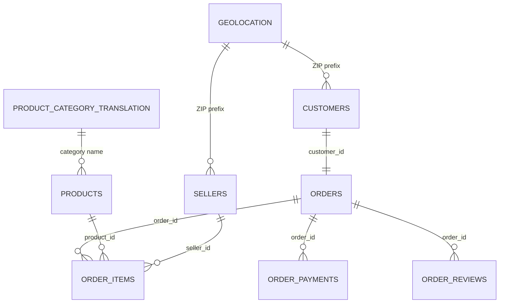

# Milestone 4B: PostgreSQL Database Design

## Overview

The Milestone 4B database is a curated relational model for PostgreSQL 16+. It represents all nine Olist business tables, enforces verified source keys, resolves lookup dependencies through conformed category and ZIP-prefix tables, and supports common analytical access paths.

Files are applied in this order:

1. `database/schema.sql` — schema and table columns
2. `database/constraints.sql` — primary keys, uniqueness, nullability, checks, and foreign keys
3. `database/indexes.sql` — non-constraint query indexes

No database objects were executed or populated during this design milestone.

## Naming Conventions

- Database namespace: `olist_analytics`
- Tables and columns: lowercase `snake_case`
- Primary keys: `pk_<table>`
- Foreign keys: `fk_<child>_<parent-or-role>`
- Unique constraints: `uq_<table>_<columns>`
- Check constraints: `ck_<table>_<rule>`
- Indexes: `idx_<table>_<columns-or-purpose>`
- Source identifiers retain their original semantic names.
- The two source headers ending in `lenght` are corrected to `product_name_length` and `product_description_length` only in the curated table; raw CSV headers remain unchanged.

## Table Creation and Dependency Order

| Order | Table | Depends on |
|---:|---|---|
| 1 | `product_category_translation` | None |
| 2 | `geolocation` | None |
| 3 | `customers` | `geolocation` |
| 4 | `products` | `product_category_translation` |
| 5 | `sellers` | `geolocation` |
| 6 | `orders` | `customers` |
| 7 | `order_items` | `orders`, `products`, `sellers` |
| 8 | `order_payments` | `orders` |
| 9 | `order_reviews` | `orders` |

`schema.sql` creates all tables without foreign keys, so DDL creation itself is safe and simple. `constraints.sql` first establishes every referenced primary key, then adds foreign keys in dependency order. The graph is acyclic: no parent depends on its child.

## Primary Keys

| Table | Primary key |
|---|---|
| `product_category_translation` | `product_category_name` |
| `geolocation` | `geolocation_zip_code_prefix` |
| `customers` | `customer_id` |
| `products` | `product_id` |
| `sellers` | `seller_id` |
| `orders` | `order_id` |
| `order_items` | (`order_id`, `order_item_id`) |
| `order_payments` | (`order_id`, `payment_sequential`) |
| `order_reviews` | (`review_id`, `order_id`) |

There are nine primary-key constraints. `orders.customer_id` also has a unique constraint because the source model contains exactly one order-level customer row per order. `customer_unique_id` intentionally remains non-unique because it identifies repeat buyers across order-level customer records.

## Foreign Keys and Relationships

### Geolocation to customers

`customers.customer_zip_code_prefix` references `geolocation.geolocation_zip_code_prefix`. One conformed ZIP prefix can describe many customer records. ETL must add controlled unmatched ZIP members before customers load.

### Category translation to products

`products.product_category_name` references `product_category_translation.product_category_name`. One category can describe many products. ETL expands the supplied lookup with the two untranslated source categories and an Unknown category for null source values.

### Geolocation to sellers

`sellers.seller_zip_code_prefix` references `geolocation.geolocation_zip_code_prefix`. One conformed ZIP prefix can describe many sellers. Unmatched seller prefixes require controlled dimension members.

### Customers to orders

`orders.customer_id` references `customers.customer_id`. The unique constraint on `orders.customer_id` models the source as one order per order-level customer row. Repeat buyers are connected separately through `customers.customer_unique_id`.

### Orders to order items

`order_items.order_id` references `orders.order_id`. One order can contain zero or many item rows. The item sequence is unique only within its order.

### Products to order items

`order_items.product_id` references `products.product_id`. One product can appear in many order-item rows.

### Sellers to order items

`order_items.seller_id` references `sellers.seller_id`. One seller can fulfil many item rows, and one order may contain items from different sellers.

### Orders to payments

`order_payments.order_id` references `orders.order_id`. One order can have zero or many sequential payment events.

### Orders to reviews

`order_reviews.order_id` references `orders.order_id`. One order can have zero or many raw review rows. The raw review table requires the composite (`review_id`, `order_id`) because neither source field is unique alone.

All foreign keys use `ON UPDATE RESTRICT` and `ON DELETE RESTRICT`. Curated analytical history should not cascade-delete merely because a parent mutation is attempted.

## Mermaid ER Diagram

## Datatype Decisions

### Identifiers

Olist identifiers are 32-character hexadecimal-style strings. They use `varchar(32)` plus length checks rather than numeric types because they are opaque business identifiers, not quantities. `varchar` avoids fixed-width padding behavior.

### Text and codes

- Cities, category names, statuses, payment types, and comments use `text` because PostgreSQL handles variable-length text efficiently and artificial length limits add little integrity value.
- Brazilian state codes use `char(2)` plus a two-uppercase-letter check.
- Review comment fields remain nullable `text` because written feedback is optional.

### ZIP prefixes and sequences

ZIP prefixes, item sequences, payment sequences, counts, lengths, weights, and dimensions use `integer`. ZIP prefixes are stored numerically because the source supplies them as integers; presentation layers should format leading zeros when necessary.

### Monetary fields

Price, freight, and payment amounts use `numeric(12,2)`. Exact decimal storage avoids binary floating-point rounding in financial calculations and provides ample range for this dataset.

### Coordinates

Latitude and longitude use `numeric(10,7)`, giving deterministic decimal precision at a level finer than required for marketplace geographic analysis. Bounds are enforced with checks.

### Timestamps

Source business events use `timestamp without time zone` because the dataset does not supply timezone offsets. The database must not falsely label them UTC. ETL audit timestamps use `timestamp with time zone` and default to the database current time.

### Nullable product attributes

Product category, descriptive lengths, photo count, weight, and dimensions are nullable in the raw source. In the curated design, category is made non-null only after ETL maps null source categories to the controlled Unknown member. Other optional product attributes remain nullable.

## Check and Nullability Decisions

- Keys, required business identifiers, statuses, required timestamps, amounts, and ETL audit timestamps are `NOT NULL`.
- Optional order lifecycle timestamps remain nullable.
- Optional review title/message and product measures remain nullable.
- Identifier length, state format, status domain, rating range, coordinate bounds, positive sequences, non-negative measures, and basic timestamp chronology are checked.
- Zero monetary/measure values are permitted initially because EDA did not establish that zero is always invalid.
- The literal payment category `not_defined`, if present, is not treated as SQL null.
- Geography rows with `unmatched` or `unknown` quality status must have null coordinates rather than fabricated values.

## Index Design

PostgreSQL automatically creates indexes for primary keys and the `orders.customer_id` unique constraint. The following 17 additional indexes support foreign-key joins and common analytical filters.

| Index | Columns | Reason |
|---|---|---|
| `idx_customers_unique_id` | `customers.customer_unique_id` | Groups repeat purchases by stable buyer identity |
| `idx_customers_state` | `customers.customer_state` | Regional customer filtering and aggregation |
| `idx_customers_zip_code_prefix` | Customer ZIP prefix | Speeds geography FK joins |
| `idx_geolocation_state` | `geolocation.geolocation_state` | Filters conformed geography by state |
| `idx_category_english` | English category | Supports English-label searches and filters |
| `idx_products_category` | Product category | Speeds category joins and product grouping |
| `idx_sellers_state` | `sellers.seller_state` | Regional seller filtering |
| `idx_sellers_zip_code_prefix` | Seller ZIP prefix | Speeds geography FK joins |
| `idx_orders_purchase_timestamp` | Purchase timestamp | Time-series range scans |
| `idx_orders_status_purchase_timestamp` | Status, purchase timestamp | Status-filtered operational trends; leftmost status supports status-only filters |
| `idx_order_items_product_id` | Product ID | Product-to-item joins and product performance queries |
| `idx_order_items_seller_id` | Seller ID | Seller-to-item joins and seller performance queries |
| `idx_order_items_shipping_limit_date` | Shipping limit | Deadline-range and fulfilment queries |
| `idx_order_payments_type` | Payment type | Payment-method grouping/filtering |
| `idx_order_reviews_order_id` | Order ID | Required because the review PK begins with `review_id`, not `order_id` |
| `idx_order_reviews_score` | Review score | Satisfaction filters and distributions |
| `idx_order_reviews_creation_date` | Review creation date | Review time-series range scans |

The composite primary keys on order items and payments already support `order_id` lookups through their leftmost column, so separate order-ID indexes are unnecessary. Index usefulness should be verified later with `EXPLAIN (ANALYZE, BUFFERS)` against real workloads; unused indexes should not be retained automatically.

## Constraint and Dependency Validation

| Foreign key | Referenced key exists? | Parent precedes child? |
|---|:---:|:---:|
| Customers ZIP → Geolocation ZIP PK | Yes | Yes |
| Products category → Category PK | Yes | Yes |
| Sellers ZIP → Geolocation ZIP PK | Yes | Yes |
| Orders customer → Customers PK | Yes | Yes |
| Items order → Orders PK | Yes | Yes |
| Items product → Products PK | Yes | Yes |
| Items seller → Sellers PK | Yes | Yes |
| Payments order → Orders PK | Yes | Yes |
| Reviews order → Orders PK | Yes | Yes |

Validation result:

- Nine tables are defined.
- Nine primary keys are defined.
- Nine foreign keys reference existing primary keys.
- Seventeen explicit non-constraint indexes are defined.
- No circular foreign-key dependency exists.
- Tables and constraints have a valid creation order.
- All object names follow the documented convention.

## Assumptions

1. The target is a curated model, not a byte-for-byte raw staging schema.
2. Raw geolocation is consolidated to exactly one row per ZIP prefix before database loading.
3. ETL adds controlled geography rows for the 157 unmatched customer prefixes and 7 unmatched seller prefixes; their coordinates remain null.
4. ETL expands category translation for two currently untranslated categories and maps 610 null product categories to an Unknown member.
5. Source timestamps represent local Brazilian business time, but no precise timezone can be asserted from the files.
6. The eight observed order-status values form the initial allowed domain; schema migration is required if the source introduces a new status.
7. `orders.customer_id` remains unique because this dataset uses an order-level customer record. Repeat customers are identified by `customer_unique_id`.
8. Non-negative zero values are retained unless later business validation proves them invalid.
9. SQL files are one-time migration inputs; a migration tool records successful application.

## Recommended Execution Sequence

After approval and before data loading:

1. Run the SQL in a disposable PostgreSQL 16 test database.
2. Inspect DDL with PostgreSQL-native tools and verify all constraints/indexes.
3. Test representative valid, invalid, null, duplicate, and orphan inserts inside rollback-only transactions.
4. Confirm the ETL category/geography conformance rules can satisfy strict lookup FKs.
5. Measure bulk-load behavior and decide whether indexes/FKs should be created after initial staging loads.
6. Version the SQL through a database migration tool.

The next implementation milestone should build and test the extraction/validation layer and PostgreSQL migration workflow before attempting a full data load.
