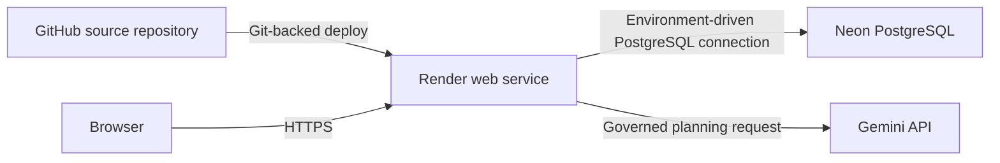

# Milestone 21 — Cloud Deployment and Production Validation

## Status and Scope

InsightFlow AI is deployed through GitHub, Render, Neon PostgreSQL, and Gemini. M21 audited deployment portability, ran a focused compatibility smoke, and incorporated manually verified production evidence without rebuilding infrastructure, changing database objects, modifying business data, or repeating the full M9–M20 regression.

The live Render application, health endpoint, core dashboard, Neon database, and governed Render → Gemini → Neon Assistant path have been manually verified. The live URL remains omitted because it is not recorded in repository metadata.

## Production Architecture



- **Source control:** GitHub, default branch `main`
- **Application hosting:** Render web service
- **Application:** Streamlit
- **Managed database:** Neon PostgreSQL
- **AI provider:** Gemini

## Deployment Configuration

The repository has no `render.yaml` or `Procfile`; the existing service is therefore expected to keep its build/start settings in the Render dashboard.

Verified existing-service configuration:

```text
Build: python -m pip install -r requirements.txt
Start: streamlit run streamlit_app/app.py --server.port $PORT --server.address 0.0.0.0 --server.enableCORS false --server.enableXsrfProtection false
Health: /_stcore/health
```

`requirements.txt` contains the application runtime dependencies for Streamlit, PostgreSQL, Plotly, exports, forecasting, and governed SQL validation. Application path discovery uses paths relative to source files and has no required developer-specific absolute path. There is no localhost-only database or provider assumption.

## Production Environment Variables

Names only—values must remain in Render's protected environment configuration:

- `DB_HOST`
- `DB_PORT`
- `DB_NAME`
- `DB_USER`
- `DB_PASSWORD`
- `AI_API_KEY`
- `AI_PROVIDER`
- `AI_MODEL`
- `AI_BASE_URL`

Render supplies `PORT` to the start command. `.env` and `.streamlit/secrets.toml` remain ignored. The local `insightflow_ai_backup.dump` file is ignored and is not tracked.

## Validation Performed

### Repository and security

- GitHub remote and `main` branch confirmed
- Environment-only database and AI configuration confirmed
- Required runtime dependencies confirmed
- No tracked dump files, hard-coded credentials, password-bearing connection strings, or private keys detected
- `.env`, `.streamlit/secrets.toml`, and `*.dump` ignore rules confirmed

### Focused application compatibility smoke

The current environment rendered these paths headlessly with zero Python or Streamlit exceptions:

- Executive Overview, including Business Health and recommendations
- Sales Analytics
- Customer Intelligence
- Product Intelligence
- Seller Intelligence
- Governed AI Assistant page
- All four Compare/Explain modes
- Forecasting workspace

This is a deployment-focused compatibility smoke, not a repeat of the historical full regression.

### Live Render validation

- The live application was accessible and functioning.
- `/_stcore/health` returned `ok`.
- The core dashboard rendered successfully in production.
- The documented Render start command and required environment-variable names were confirmed in the service configuration.

### PostgreSQL compatibility

- Connection succeeded to the configured `insightflow_ai` database
- `olist_analytics` was accessible
- Ten critical tables/views/materialized views were present
- A representative order query executed successfully
- Governed Assistant execution reported read-only transaction mode

Manual live Neon verification additionally confirmed successful migration, SSL/TLS connectivity, all required `olist_analytics` relations, and these representative counts:

- `orders`: 99,441
- `customers`: 99,441
- `products`: 32,951
- `sellers`: 3,095
- `mv_order_revenue`: 99,441 rows

### Gemini compatibility

- Gemini configuration loaded from environment
- One supported governed request completed successfully
- Existing provider-failure behavior remains manual and graceful
- The provider still produces only a constrained plan; semantic validation, deterministic SQL generation, sqlglot validation, and read-only execution remain in the application
- No automatic provider retry loop was introduced

The live Render Assistant successfully answered “Show the monthly revenue trend.” with the expected answer, chart, and scope and without provider or database errors. This verifies the production Render → Gemini → Neon path.

## Known Limitations

- Customer State and Product Category controls may have a lighter background on Render than locally. This is cosmetic and non-blocking; no redesign was made.
- Current Streamlit versions emit `use_container_width` deprecation warnings. They are non-blocking and were intentionally not addressed through broad UI churn.

## Safe Update and Redeployment Workflow

1. Run focused tests for the changed area locally.
2. Review the diff and repeat the redacted secrets scan.
3. Merge the reviewed change to the Render deployment branch.
4. Allow the existing Git-backed Render service to deploy normally; do not recreate the service or Neon database.
5. Confirm `/_stcore/health` returns HTTP 200.
6. Smoke Executive Overview and the directly affected page.
7. Run one representative read-only database query and, only when Assistant code/configuration changed, one supported governed Gemini request.
8. Review Render logs for safe exception types without printing environment values.

## Rollback and Recovery

- **Application rollback:** redeploy the last known-good Git commit through the existing Render service. Do not create a replacement service unless the existing service itself is unrecoverable.
- **Configuration rollback:** restore the prior Render environment configuration from the platform's protected settings; never copy values into the repository or tickets.
- **Database recovery:** use Neon restore/branching capabilities or the approved protected backup process. Do not apply schema scripts, refresh materialized views, or restore dumps as part of an application rollback without a separate database change plan.
- **Provider incident:** leave analytics pages available, preserve manual retry, and restore the previous provider configuration in Render after confirming quota/model availability.

## Freeze Decision

All required M21 production evidence is complete. The live Render application and health endpoint, production configuration, Neon schema/data compatibility with SSL/TLS, and governed Render → Gemini → Neon Assistant path passed. M21 is safe to freeze.
