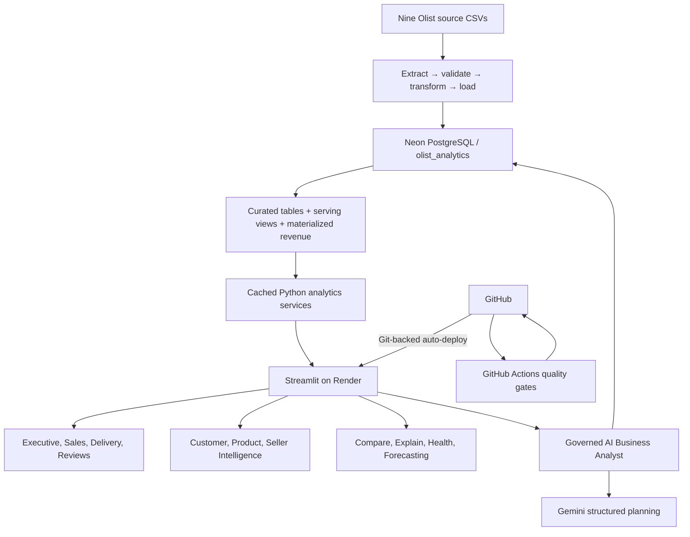

# InsightFlow AI — Current Architecture

## System Overview

InsightFlow AI is a production-deployed analytical application built from an immutable public e-commerce dataset, a validated Python ETL pipeline, governed PostgreSQL storage, reusable analytics and intelligence services, a nine-page Streamlit interface, and a constrained Gemini planning integration.

## Data and ETL

The nine raw Olist files remain outside Git and are treated as immutable input. The Python ETL pipeline extracts tables in dependency order, validates required columns and primary keys, applies schema-aligned transformations, checks every foreign-key relationship in memory, and loads the curated PostgreSQL tables. Schema creation, loading, constraints, indexes, and analytics-serving objects remain separate, explicit steps.

## PostgreSQL Analytics Layer

The `olist_analytics` schema contains source-aligned curated tables for category translation, geography, customers, products, sellers, orders, order items, payments, and reviews. Constraints protect entity relationships, while targeted indexes support timestamp, state, category, seller, payment, and review access patterns.

Three serving objects stabilize analytics:

- `mv_order_revenue`: one row per order with payment, merchandise, freight, and total-item values
- `vw_order_revenue`: stable read interface over materialized order economics
- `vw_order_delivery_metrics`: actual delivery duration, promise variance, and delivery classification

Application services prefer these objects and retain a tested fallback CTE architecture. Production uses Neon PostgreSQL over SSL/TLS.

## Application and Intelligence Services

Streamlit pages call domain services rather than embedding business logic in UI components. Five-minute data caches avoid repeated read workloads for unchanged filter scopes. The application provides Executive, Sales, Customer, Product, Seller, Delivery, Review, Reports, and AI Assistant workspaces.

Deterministic intelligence modules implement:

- RFM segmentation and customer-value concentration
- Product/Seller signals and portfolio concentration
- Rolling robust anomaly/opportunity detection
- Comparable-period and entity comparison
- Descriptive KPI driver decomposition
- Transparent Business Health scoring and recommendations
- Five-model expanding-window forecast selection

Global date, destination-state, and category filters use an immutable `FilterState` shared across services.

## Governed AI Boundary

Gemini never receives database credentials and never executes arbitrary SQL or Python. It maps a question and current filter context to a constrained structured plan. The application validates plan metadata, generates deterministic parameterized SQL, parses it with sqlglot, checks semantic/schema/table/column/function/join/limit policies, and executes through a dedicated read-only PostgreSQL connection with a 10-second timeout and 100-row cap. Results are verified before deterministic formatting, visualization, and evidence display.

## Production and Delivery

GitHub is the source of truth. GitHub Actions runs compile, repository-safety, and 90 deterministic test gates without production credentials. CI validation and deployment are separate: Render auto-deploys the Git-backed Streamlit service through its existing configuration. Render connects to Neon and Gemini using protected environment variables. Production health, database compatibility, and the Render → Gemini → Neon path were validated in M21.

## Security and Failure Isolation

- Environment-only secrets; forbidden-file CI gate
- Read-only application queries and stricter dedicated Assistant execution
- Parameterization and semantic SQL allowlists
- Bounded statements and result sizes
- Provider failures classified separately with manual retry
- Forecast failures isolated to the forecast workspace
- Safe operational logging without secret/configuration values
- Generic user-facing failure messages that preserve other available analytics where possible

Detailed design history remains in the numbered milestone documents under `docs/`.
