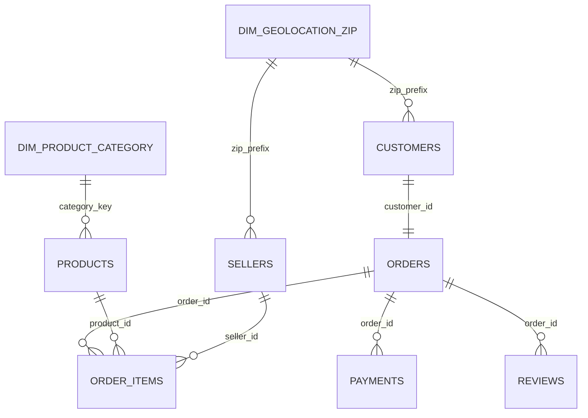

# Olist Data Dictionary

## Scope and Conventions

This dictionary documents all 52 columns in the nine raw Olist tables and their proposed curated data types. CSV files do not enforce types; ETL will preserve raw values in staging and create typed curated columns only after validation.

Key notation:

- **PK** — primary-key member.
- **FK** — foreign key in the curated model.
- **Yes (source)** — nulls were observed and are allowed under the proposed rule.
- **No** — required for curated loading.
- Examples come from the raw dataset; `NULL` represents an absent value.

PostgreSQL type choices remain design proposals until database schema approval.

## Customers — `olist_customers_dataset.csv`

**Purpose:** One order-level customer record per order, with a stable identity for recognizing repeat buyers and source location attributes.

| Column | Proposed type | Business meaning | PK | FK | Nullable | Example |
|---|---|---|:---:|---|:---:|---|
| `customer_id` | `char(32)` | Order-level customer identifier | Yes | — | No | `06b8999e2fba1a1fbc88172c00ba8bc7` |
| `customer_unique_id` | `char(32)` | Stable buyer identity across orders | No | — | No | `861eff4711a542e4b93843c6dd7febb0` |
| `customer_zip_code_prefix` | `integer` | Customer postal-code prefix | No | `dim_geolocation_zip.geolocation_zip_code_prefix` | No | `14409` |
| `customer_city` | `text` | Source customer city | No | — | No | `franca` |
| `customer_state` | `char(2)` | Brazilian state code | No | — | No | `SP` |

## Geolocation — `olist_geolocation_dataset.csv`

**Purpose:** Raw coordinate observations associated with Brazilian ZIP prefixes. The raw file has no natural PK; ETL will produce one curated row per ZIP prefix.

| Column | Proposed type | Business meaning | PK | FK | Nullable | Example |
|---|---|---|:---:|---|:---:|---|
| `geolocation_zip_code_prefix` | `integer` | Postal-code prefix; proposed curated geography key | Curated only | — | No | `1037` |
| `geolocation_lat` | `numeric(10,7)` | Latitude of source observation | No | — | No | `-23.5456213` |
| `geolocation_lng` | `numeric(10,7)` | Longitude of source observation | No | — | No | `-46.6392920` |
| `geolocation_city` | `text` | City label for source observation | No | — | No | `sao paulo` |
| `geolocation_state` | `char(2)` | State label for source observation | No | — | No | `SP` |

Planned derived curated metadata (not raw columns): observation count, distinct coordinate count, label support count, and quality flag.

## Orders — `olist_orders_dataset.csv`

**Purpose:** One row per order, covering customer association, status, purchase, approval, fulfilment, delivery, and promised delivery.

| Column | Proposed type | Business meaning | PK | FK | Nullable | Example |
|---|---|---|:---:|---|:---:|---|
| `order_id` | `char(32)` | Unique order identifier | Yes | — | No | `e481f51cbdc54678b7cc49136f2d6af7` |
| `customer_id` | `char(32)` | Order-level customer | No | `customers.customer_id` | No | `9ef432eb6251297304e76186b10a928d` |
| `order_status` | `text` | Current or final lifecycle status | No | — | No | `delivered` |
| `order_purchase_timestamp` | `timestamp` | Time customer placed order | No | — | No | `2017-10-02 10:56:33` |
| `order_approved_at` | `timestamp` | Approval timestamp | No | — | Yes (source) | `2017-10-02 11:07:15` |
| `order_delivered_carrier_date` | `timestamp` | Carrier handoff timestamp | No | — | Yes (source) | `2017-10-04 19:55:00` |
| `order_delivered_customer_date` | `timestamp` | Customer delivery timestamp | No | — | Yes (source) | `2017-10-10 21:25:13` |
| `order_estimated_delivery_date` | `timestamp` | Promised delivery timestamp | No | — | No | `2017-10-18 00:00:00` |

## Order Items — `olist_order_items_dataset.csv`

**Purpose:** One product/seller item position within an order, including price, freight, and seller shipping deadline.

| Column | Proposed type | Business meaning | PK | FK | Nullable | Example |
|---|---|---|:---:|---|:---:|---|
| `order_id` | `char(32)` | Parent order | Yes | `orders.order_id` | No | `00010242fe8c5a6d1ba2dd792cb16214` |
| `order_item_id` | `integer` | Sequential item number within order | Yes | — | No | `1` |
| `product_id` | `char(32)` | Purchased product | No | `products.product_id` | No | `4244733e06e7ecb4970a6e2683c13e61` |
| `seller_id` | `char(32)` | Seller fulfilling item | No | `sellers.seller_id` | No | `48436dade18ac8b2bce089ec2a041202` |
| `shipping_limit_date` | `timestamp` | Seller shipping deadline | No | — | No | `2017-09-19 09:45:35` |
| `price` | `numeric(12,2)` | Item selling price | No | — | No | `58.90` |
| `freight_value` | `numeric(12,2)` | Freight charged for item | No | — | No | `13.29` |

Composite PK: (`order_id`, `order_item_id`).

## Payments — `olist_order_payments_dataset.csv`

**Purpose:** One sequential payment event for an order, including method, installments, and amount.

| Column | Proposed type | Business meaning | PK | FK | Nullable | Example |
|---|---|---|:---:|---|:---:|---|
| `order_id` | `char(32)` | Paid order | Yes | `orders.order_id` | No | `b81ef226f3fe1789b1e8b2acac839d17` |
| `payment_sequential` | `integer` | Payment sequence within order | Yes | — | No | `1` |
| `payment_type` | `text` | Payment method | No | — | No | `credit_card` |
| `payment_installments` | `integer` | Number of installments | No | — | No | `8` |
| `payment_value` | `numeric(12,2)` | Value of payment event | No | — | No | `99.33` |

Composite PK: (`order_id`, `payment_sequential`).

## Reviews — `olist_order_reviews_dataset.csv`

**Purpose:** Customer score and optional written feedback associated with an order.

| Column | Proposed type | Business meaning | PK | FK | Nullable | Example |
|---|---|---|:---:|---|:---:|---|
| `review_id` | `char(32)` | Review identifier; not unique alone | Yes | — | No | `7bc2406110b926393aa56f80a40eba40` |
| `order_id` | `char(32)` | Reviewed order; not unique alone | Yes | `orders.order_id` | No | `73fc7af87114b39712e6da79b0a377eb` |
| `review_score` | `smallint` | Satisfaction score from 1 to 5 | No | — | No | `4` |
| `review_comment_title` | `text` | Optional review title | No | — | Yes (source) | `NULL` |
| `review_comment_message` | `text` | Optional review message | No | — | Yes (source) | `NULL` |
| `review_creation_date` | `timestamp` | Review creation date | No | — | No | `2018-01-18 00:00:00` |
| `review_answer_timestamp` | `timestamp` | Review submission/answer timestamp | No | — | No | `2018-01-18 21:46:59` |

Composite PK: (`review_id`, `order_id`).

## Products — `olist_products_dataset.csv`

**Purpose:** One row per product with category, descriptive metadata, photos, weight, and physical dimensions.

| Column | Proposed type | Business meaning | PK | FK | Nullable | Example |
|---|---|---|:---:|---|:---:|---|
| `product_id` | `char(32)` | Unique product identifier | Yes | — | No | `1e9e8ef04dbcff4541ed26657ea517e5` |
| `product_category_name` | `text` | Source Portuguese category | No | `dim_product_category.product_category_name` via category key | Yes (source) | `perfumaria` |
| `product_name_lenght` | `integer` | Source-provided product-name length | No | — | Yes (source) | `40` |
| `product_description_lenght` | `integer` | Source-provided description length | No | — | Yes (source) | `287` |
| `product_photos_qty` | `integer` | Number of product photos | No | — | Yes (source) | `1` |
| `product_weight_g` | `integer` | Product weight in grams | No | — | Yes (source) | `225` |
| `product_length_cm` | `integer` | Product length in centimetres | No | — | Yes (source) | `16` |
| `product_height_cm` | `integer` | Product height in centimetres | No | — | Yes (source) | `10` |
| `product_width_cm` | `integer` | Product width in centimetres | No | — | Yes (source) | `14` |

The source spellings `lenght` remain unchanged in raw/staging data. A future curated schema may expose correctly spelled aliases while retaining lineage.

## Sellers — `olist_sellers_dataset.csv`

**Purpose:** One row per marketplace seller with source city, state, and postal prefix.

| Column | Proposed type | Business meaning | PK | FK | Nullable | Example |
|---|---|---|:---:|---|:---:|---|
| `seller_id` | `char(32)` | Unique seller identifier | Yes | — | No | `3442f8959a84dea7ee197c632cb2df15` |
| `seller_zip_code_prefix` | `integer` | Seller postal-code prefix | No | `dim_geolocation_zip.geolocation_zip_code_prefix` | No | `13023` |
| `seller_city` | `text` | Source seller city | No | — | No | `campinas` |
| `seller_state` | `char(2)` | Brazilian state code | No | — | No | `SP` |

## Product Category Translation — `product_category_name_translation.csv`

**Purpose:** Portuguese-to-English product-category lookup supplied with the dataset.

| Column | Proposed type | Business meaning | PK | FK | Nullable | Example |
|---|---|---|:---:|---|:---:|---|
| `product_category_name` | `text` | Portuguese category business key | Yes | — | No | `beleza_saude` |
| `product_category_name_english` | `text` | Supplied English translation | No | — | No | `health_beauty` |

The planned `dim_product_category` will also contain a surrogate `category_key`, an Unknown member for null product categories, and controlled rows for source categories missing from this lookup. Those are ETL-managed attributes, not raw columns.

## Relationship Summary

The geography and category relationships become enforceable only after ETL creates conformed lookup members for unmatched and null source values.
